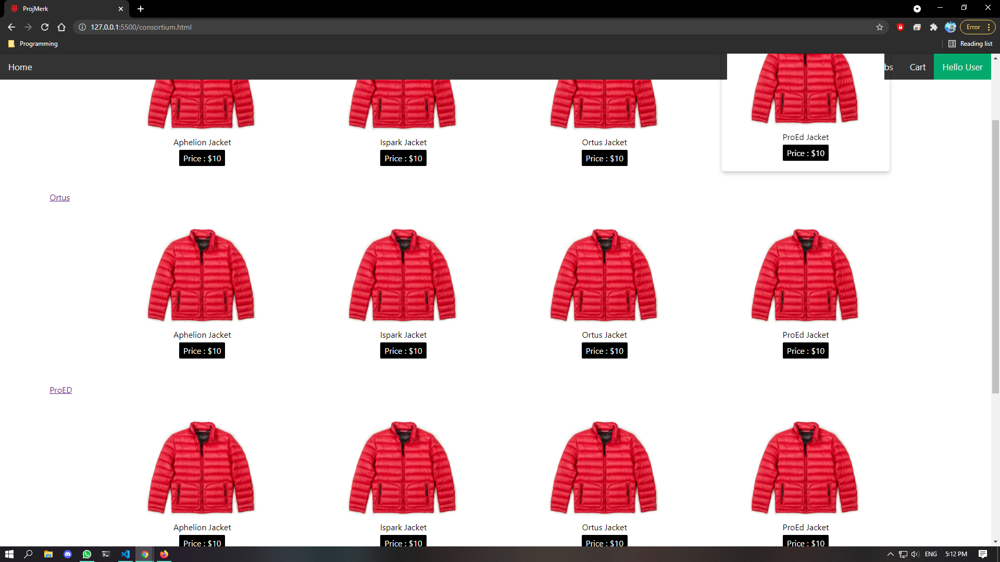
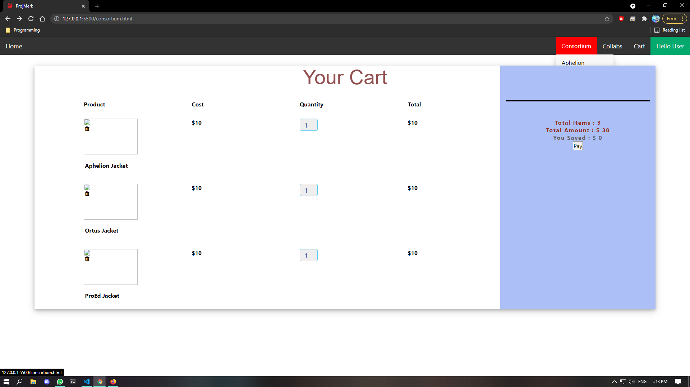

# Cotton Road

<h1 align="center"> Timeline</h1>	
February-April: Get the home page of the website completed
		Do some research on how other ecommerce websites does their payment, security and delivery  
		Research other ecommerce websites design.   

April-July: Finish the design of website including the checkout page and seller page etc  

July-August: Confirm the payment and delivery method  
	     Finalise the website in general.  
	      
Today marks a significant day for this reporsitory our repo has officially been public! 🥳 - 5th Augest 2021	      
<h1 align="center">What is used?</h1>
<ul>
	<li>HTML</li>
	<li>CSS</li>
	<li>JS</li>
	<li>Auth0</li>
	<li>MongoDB</li>
	<li>Slick Carousel</li>
	<li>Icons from Font Awesome</li>
</ul>
<h1 align="center">Website Progression</h1>
:heavy_exclamation_mark: Fix the navbar 

:heavy_check_mark: Website Layout 
:heavy_check_mark: Accessibility - Navbar partially done 
:heavy_check_mark: User Account Page 
:heavy_check_mark: Add to cart feature - usage of cookies  
:heavy_check_mark: Redesigning the card item  
✔️: Add to cart page  

:heavy_exclamation_mark:Server/Backend stuff  
:heavy_exclamation_mark:Code refactor  
:heavy_exclamation_mark:Support for different screen devices  

<h1 align="center">Bugs to fix</h1>

Product card on hover covers Navbar
 

Dropdown menu gets covered by Cart page
 
:heavy_check_mark: : Completed
:x: : Not complete
:x: :heavy_exclamation_mark: : Not complete and higher priority

